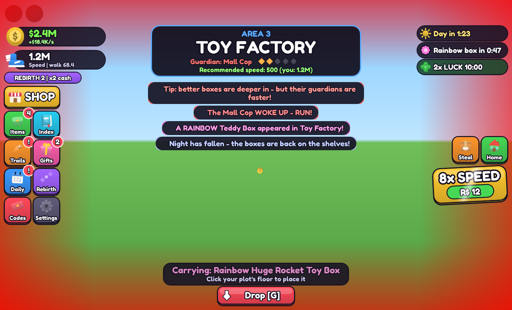
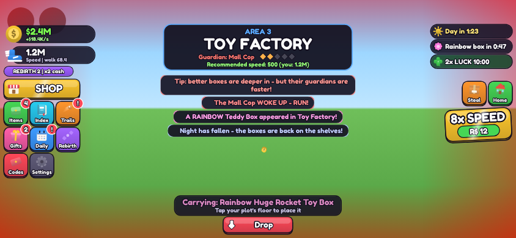
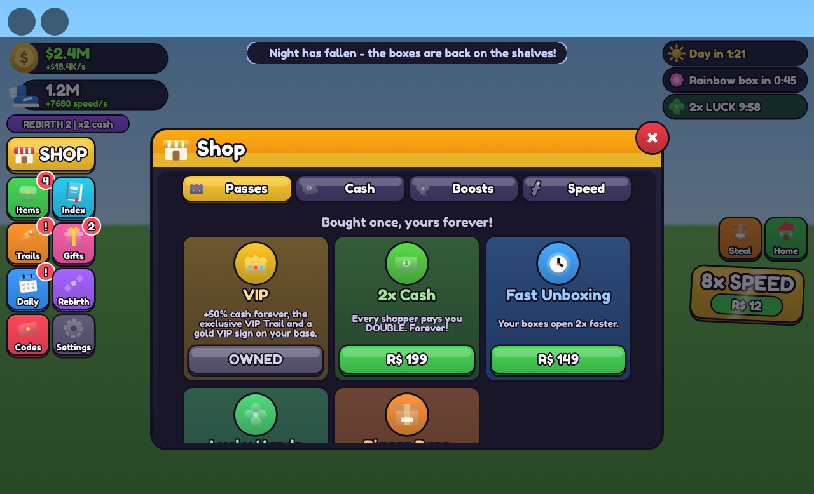
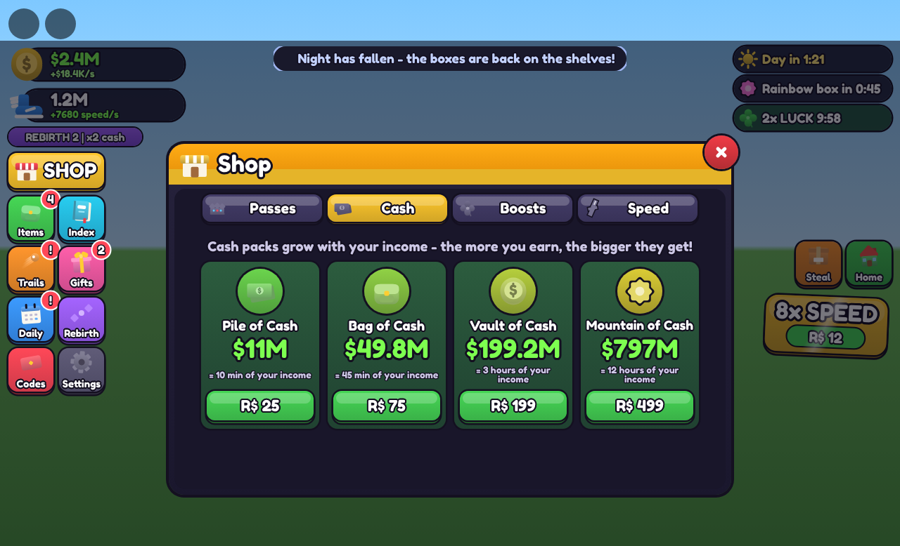
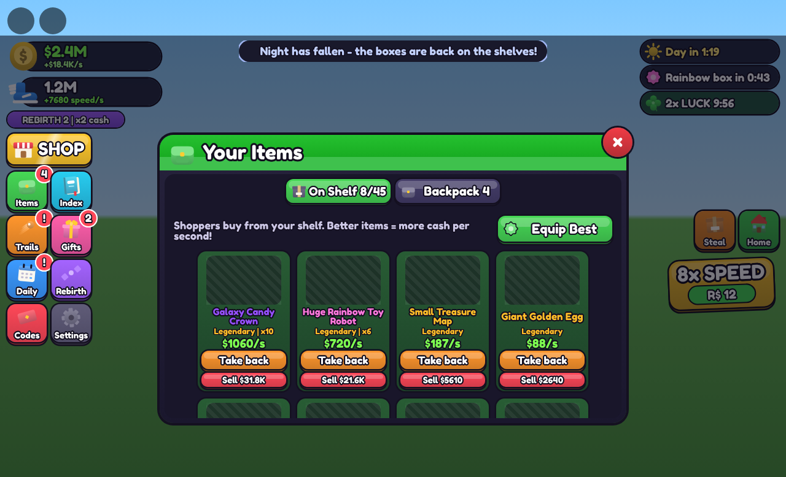
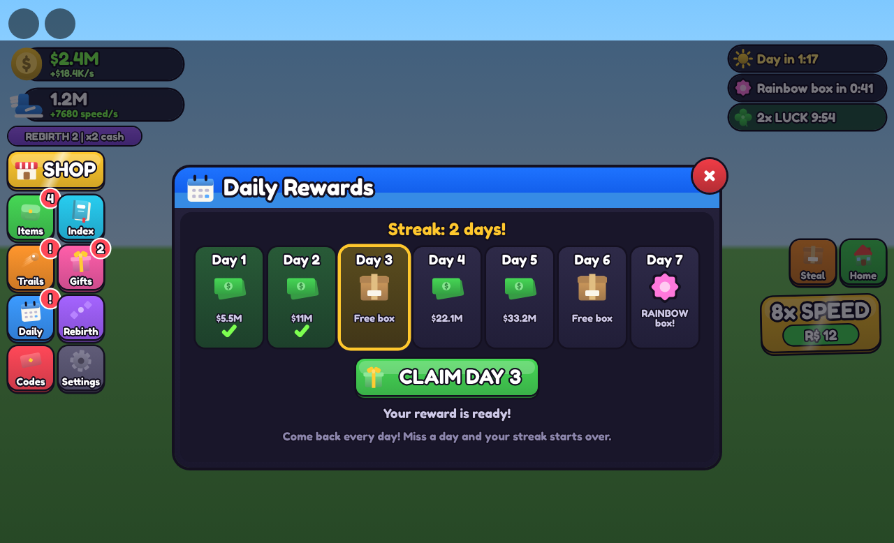

# Steal a Box

Steal boxes from a guarded warehouse, unbox them at your base, sell the items in your shop and get faster on your treadmill.

**Open `StealABox_v5.rbxl` in Roblox Studio.** (`StealABox_polished_v4.rbxl` is the previous version, kept for reference.)

| PC | Phone |
| --- | --- |
|  |  |
|  |  |
|  |  |

*Previews are drawn from the game's real UI code in a web browser, so fonts and 3D item previews look a little different in Roblox.*

## Before you publish

1. **Server size: 6 players.** There are 6 plots, so set the place's **Max Players** to 6 in its settings on the Creator Dashboard.
2. **Saving in Studio:** Game Settings > Security > **Enable Studio Access to API Services**.
3. **Set up the Robux shop** (below).

## Set up the Robux shop

Everything you sell is in **ReplicatedStorage > StealABoxShop**:

| What | Kind | Default price |
| --- | --- | --- |
| VIP (+50% cash, VIP Trail, gold base sign) | Game pass | 249 |
| 2x Cash | Game pass | 199 |
| Fast Unboxing (2x faster) | Game pass | 149 |
| Lucky Hands (extra mutation roll) | Game pass | 179 |
| Bigger Base (+4 unboxing spots) | Game pass | 99 |
| Pile / Bag / Vault / Mountain of Cash (scale with your income) | Developer product | 25 / 75 / 199 / 499 |
| Instant Unbox | Developer product | 39 |
| Lucky Box (guaranteed Rainbow, 1 in 5 Galaxy) | Developer product | 99 |
| Server Luck (2x mutations for everyone, 15 min) | Developer product | 149 |
| Speed boosts 2x ... 1024x (one product per tier) | Developer product | 3, 6, 12 ... 1536 |

1. Publish the game.
2. On [create.roblox.com](https://create.roblox.com) open your experience and go to **Monetization**. Create one **Pass** for each pass and one **Developer Product** for each product (including each speed boost tier).
3. Paste each ID into `id = 0` in **StealABoxShop**, and the speed-boost IDs into `SpeedBoostIds`.

While an ID is still `0`, the item is **free in Studio** so you can test it, and shows **SOON** in live servers. Once the IDs are set, the shop shows the real prices from Roblox.

Purchases are safe: each developer-product receipt is stored in the player's save before Roblox is told it went through. A purchase is never given twice, and it's never lost if saving fails (Roblox retries it).

## What's new in v5

**Robux shop.** A full shop window with tabs for Passes, Cash, Boosts and Speed, plus a "THANK YOU!" celebration after a purchase.

**New GUI.**
- One consistent chunky, outlined simulator style, with springy buttons and windows.
- A 2-column menu (3 columns on phones) and a big SHOP button.
- Cash and speed counters that show `$/s`.
- Timers on the right: day/night, rainbow box and server luck.
- Separate layouts for PC and phone.

**No more text layering.**
- Every screen region is a stack, so cards and messages line up instead of overlapping.
- Text shrinks to fit its box.
- Only the product you stand next to shows its name tag (45 tags used to pile up on each shelf).
- Only the nearest unboxing box shows its name.
- Sale `+$` pops come from the shopper, not the shelf.
- Other players' "Take back / Open / Upgrade" prompts are hidden from you.

**New features**, inspired by popular simulators:
- **Rebirths** for a permanent cash and speed bonus.
- **Daily rewards**: a 7-day streak.
- **Codes**: `RELEASE`, `STEALABOX`, `ZOOM`. Add your own in `Config.Codes`.
- **Offline earnings** with a "Welcome back" popup.
- **Server Luck**.
- **Steal / Home teleport buttons**.
- **Settings**: sound, screen effects, product labels, slow mode and tutorial replay.

**Fixes.**
- Shops earned only about 60% of the `$/s` they showed. They now earn exactly their `$/s`; shoppers pay what the shop earned since the last sale.
- Up to about 200 shopper models could run at once, which lagged the server. It's now at most about 8 per shop.
- Fast rejoins could load an old save and overwrite newer progress. Saves are now locked to one server at a time.
- Robux receipts weren't recorded safely.
- Two items could end up on the same shelf spot.
- The area title card covered the tutorial.
- Long rarity words were cut off on the unbox card.
- ServerStorage > BuildMapInStudio would reinstall the old scripts. It now only builds the map.

## Changing the game

- Balance (areas, boxes, items, prices, rebirth costs, daily rewards, codes): **ReplicatedStorage > StealABoxConfig**
- Robux items: **ReplicatedStorage > StealABoxShop**
- Server logic: **ServerScriptService > StealABoxServer** (the map is built by **StealABoxMap**)
- UI and effects: **StarterPlayerScripts > StealABoxClient** and its modules (`UI`, `Hud`, `Windows`, `ShopWindow`, `Tutorial`, `WorldFX`)

## Project layout (for editing outside Studio)

| File | Goes to |
| --- | --- |
| `src/StealABoxConfig.luau` | ReplicatedStorage > StealABoxConfig |
| `src/StealABoxShop.luau` | ReplicatedStorage > StealABoxShop |
| `src/StealABoxServer.server.luau` | ServerScriptService > StealABoxServer |
| `src/StealABoxMap.server.luau` | ServerScriptService > StealABoxMap |
| `src/StealABoxClient.client.luau` | StarterPlayerScripts > StealABoxClient |
| `src/client/*.luau` | the ModuleScripts inside StealABoxClient |

Rebuild the place file from `src/` with [Lune](https://lune-org.github.io/docs):

```
lune run tools/build.luau StealABox_polished_v4.rbxl StealABox_v5.rbxl
```

Smoke tests (they run the real scripts in a fake engine and play through the game) are in `tools/test` (see its README).
